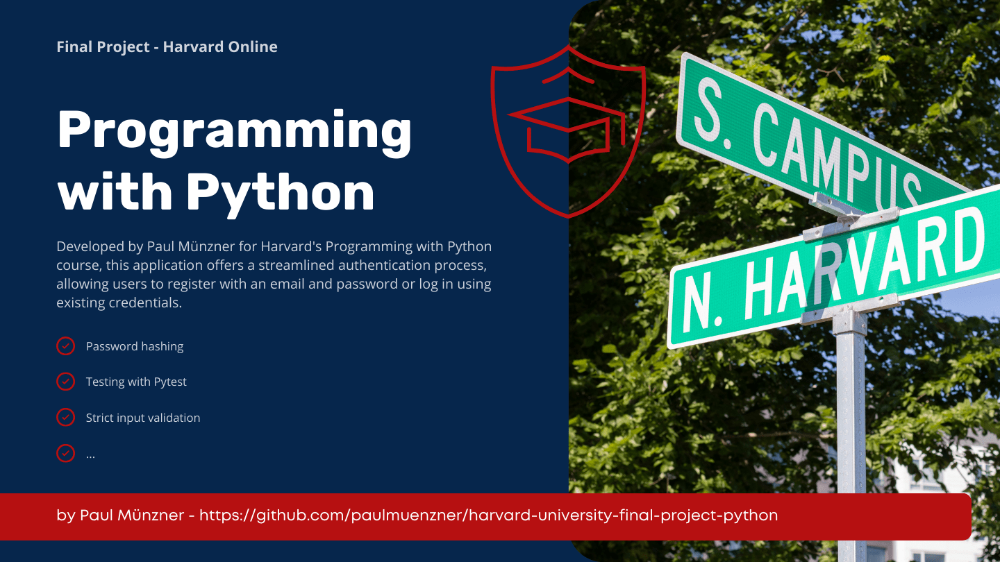

[![MIT License][license-shield]][license-url]

 
[![paulmuenzner github][github-shield]][github-url] 
[![Contributors][contributors-shield]][contributors-url]

<!-- PROJECT LOGO -->
 

  <h3 align="center">Harvard Final Project</h3>
  <h4 align="center">Programming with Python</h4>

  

    Authorization - Testing - Validation
     
    <a href="#about"><strong>EXPLORE DOCS</strong></a>
     
     
  

<!-- ABOUT THE FINAL PROJECT -->
## About

This Python application serves as the culmination of a simplified authentication process. Developed by Paul Münzner as part of Harvard's Programming with Python course, the application provides users with two distinct options. Individuals can choose to register using an email address and password or attempt to log in by providing their email address and password. This project adheres to specific requirements, guidelines and constraints outlined by Harvard.

### Details
The registration process involves validating the password using regex to ensure it adheres to a specific format. The email address is validated using the validators library installed via pip. Conversely, the login input is intentionally not validated to prevent providing hints to potential malicious users.

Upon successful registration, the relevant data, namely the email address and password in a hashed format, is stored in a CSV file. This information is essential for subsequent logins.

For the login process, the procedure differs. Initially, the program checks if there have been more than 3 failed login attempts with a specific email address within the last 10 minutes. Essentially, this serves as a rate limiter. If the rate limit threshold has been exceeded, access is denied, and the program terminates, marking the login attempt as unsuccessful.

However, if the user has not reached the 3 failed login attempts within the last 10 minutes, the login process proceeds. It verifies if the entered password is correct. In case of a mismatch, this unsuccessful attempt is recorded in a second CSV file, contributing to the rate limiter's information.

If a registration with the provided email address exists in registrations.csv and the entered password matches the registered password, the user has successfully fulfilled all the requirements of the login procedure.

## Harvard's Programming with Python

### About the course

This course, offered by Harvard University through [Harvard Online](https://www.harvardonline.harvard.edu/course/cs50s-introduction-programming-python), provides a comprehensive understanding to the world of programming using Python. Designed for both beginners and those with some prior programming experience, the course equips you with the fundamental skills and knowledge needed to navigate the exciting world of coding.

### Requirements

This Python application, developed as a final project for Harvard's course 'Introduction to Programming with Python', adheres to specific requirements and guidelines outlined by the course. Understanding these constraints will help users navigate the structure and conventions of the project. 

Understanding these requirements will provide insight into the project's structure and how it aligns with the specifications set forth by the course.

**Implementation in Python:**
-   The entire project is implemented in Python to align with the course guidelines.

**Main Function and Additional Functions:**
-   The project includes a main function along with three or more additional functions.
-   At least three of these functions are accompanied by tests that can be executed with pytest.

**File Structure:**
-   The main function is located in a file named project.py, positioned in the root (top-level folder) of the project.
-   The three required custom functions (other than main) are also in project.py and are defined at the same indentation level as the main function.

**Test Functions:**
-   Test functions are placed in a file named test_project.py, situated in the root of the project.
-   Each test function has the same name as the corresponding custom function in project.py, prepended with test_.

**Additional Implementations:**
-   Beyond the minimum requirements, the project may include additional classes and functions as deemed appropriate.

**Time and Effort:**
-   The implementation of the project involves more time and effort compared to the course’s individual problem sets.

**Requirements File:**
-   Any pip-installable libraries essential for the project are listed in a file named requirements.txt in the root of the project. Each library is listed on a separate line.

### Tech Stack 

This project is basically built with and for:

*   
*   
*   
*   

(<a href="#readme-top">back to top</a>)

<!-- GETTING STARTED -->
## Demo
Coming soon ...

<!-- ROADMAP -->
## Roadmap

This project, designed to fulfill the requirements of the Harvard University course, serves as the final assignment, and thus, no roadmap is available.

<!-- LICENSE -->
## License

Distributed under the MIT License. See [LICENSE](LICENSE.txt) for more information.

(<a href="#readme-top">back to top</a>)

<!-- CONTACT -->
## Contact

Paul Münzner: [https://paulmuenzner.com](https://paulmuenzner.com) 

Project Link: [https://github.com/paulmuenzner/harvard-university-final-project-python](https://github.com/paulmuenzner/harvard-university-final-project-python)

(<a href="#readme-top">back to top</a>)

<!-- ACKNOWLEDGMENTS -->
## Acknowledgments

Use this space to list resources you find helpful and would like to give credit to. I've included a few of my favorites to kick things off!

*   [bcrypt](https://pypi.org/project/bcrypt/)
*   [validators](https://validators.readthedocs.io/en/latest/)
*   [pytest](https://docs.pytest.org/en/8.0.x/)

(<a href="#readme-top">back to top</a>)

<!-- MARKDOWN LINKS & IMAGES -->
<!-- https://www.markdownguide.org/basic-syntax/#reference-style-links -->
[github-shield]: https://img.shields.io/badge/paulmuenzner-black.svg?logo=github&logoColor=ffffff&colorB=000000
[github-url]: https://github.com/paulmuenzner
[contributors-shield]: https://img.shields.io/github/contributors/paulmuenzner/harvard-university-final-project-python.svg
[contributors-url]: https://github.com/paulmuenzner/harvard-university-final-project-python/graphs/contributors
[issues-shield]: https://img.shields.io/github/issues/paulmuenzner/harvard-university-final-project-python.svg
[issues-url]: https://github.com/paulmuenzner/harvard-university-final-project-python/issues
[license-shield]: https://img.shields.io/badge/license-MIT-orange.svg?colorB=FF5733
[license-url]: https://github.com/paulmuenzner/harvard-university-final-project-python/blob/master/LICENSE.txt
