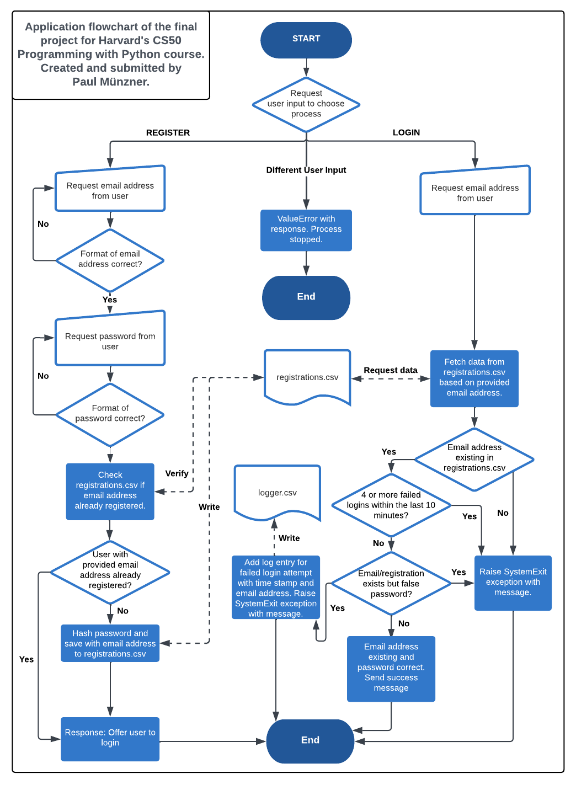

<a name="readme-top"></a>


[![GNU License][license-shield]][license-url]
 
[![paulmuenzner github][github-shield]][github-url] 
[![Contributors][contributors-shield]][contributors-url]


<!-- PROJECT LOGO -->
<br />
<div align="center">
  <a href="https://github.com/paulmuenzner/react-comment-component-ts">
    
  </a>

  <h3 align="center">React TS Comment Component</h3>

  <p align="center">
    Votes - Pagination - ReactPortal Modal
    <br />
    <a href="#about-the-project"><strong>EXPLORE DOCS</strong></a>
    <br />
    <br />
    <a href="#settings">High Flexibility</a>
    ·
    <a href="https://github.com/paulmuenzner/react-comment-component-ts/issues">Report Bug</a>
    ·
    <a href="https://github.com/paulmuenzner/react-comment-component-ts/issues">Request Feature</a>
  </p>
</div>


<!-- TABLE OF CONTENTS -->
<details>
  <summary>Table of Contents</summary>
  <ol>
    <li><a href="#about-the-project">About The Project</a></li>
    <li><a href="#features">Features</a></li>
    <li><a href="#demo">Demo</a></li>
    <li><a href="#getting-started">Getting Started</a></li>
    <li><a href="#settings">Settings</a></li>
    <li><a href="#roadmap">Roadmap</a></li>
    <li><a href="#contributing">Contributing</a></li>
    <li><a href="#license">License</a></li>
    <li><a href="#contact">Contact</a></li>
    <li><a href="#acknowledgments">Acknowledgments</a></li>
  </ol>
</details>


<!-- ABOUT THE FINAL PROJECT -->
## About

This Python application serves as the culmination of a simplified authentication process. Developed by Paul Münzner as part of Harvard's Programming with Python course, the application provides users with two distinct options. Individuals can choose to register using an email address and password or attempt to log in by providing their email address and password.

[](https://www.youtube.com/watch?v=YOUTUBE_VIDEO_ID)


### Details
The registration process involves validating the password using regex to ensure it adheres to a specific format. The email address is validated using the validators library installed via pip. Conversely, the login input is intentionally not validated to prevent providing hints to potential malicious users.

Upon successful registration, the relevant data, namely the email address and password in a hashed format, is stored in a CSV file. This information is essential for subsequent logins.

For the login process, the procedure differs. Initially, the program checks if there have been more than 3 failed login attempts with a specific email address within the last 10 minutes. Essentially, this serves as a rate limiter. If the rate limit threshold has been exceeded, access is denied, and the program terminates, marking the login attempt as unsuccessful.

However, if the user has not reached the 3 failed login attempts within the last 10 minutes, the login process proceeds. It verifies if the entered password is correct. In case of a mismatch, this unsuccessful attempt is recorded in a second CSV file, contributing to the rate limiter's information.

If a registration with the provided email address exists in registrations.csv and the entered password matches the registered password, the user has successfully fulfilled all the requirements of the login procedure.

## Harvard's Programming with Python

### About the course

This course, offered by Harvard University through [Harvard Online](https://www.harvardonline.harvard.edu/course/cs50s-introduction-programming-python), provides a comprehensive understanding to the world of programming using Python. Designed for both beginners and those with some prior programming experience, the course equips you with the fundamental skills and knowledge needed to navigate the exciting world of coding.



### Requirements

This Python application, developed as a final project for Harvard's course 'CS50’s Introduction to Programming with Python,' adheres to specific requirements and guidelines outlined by the course. Understanding these constraints will help users navigate the structure and conventions of the project. 

Understanding these requirements will provide insight into the project's structure and how it aligns with the specifications set forth by the course.

**Implementation in Python:**
-   The entire project is implemented in Python to align with the course guidelines.

**Main Function and Additional Functions:**
-   The project includes a main function along with three or more additional functions.
-   At least three of these functions are accompanied by tests that can be executed with pytest.

**File Structure:**
-   The main function is located in a file named project.py, positioned in the root (top-level folder) of the project.
-   The three required custom functions (other than main) are also in project.py and are defined at the same indentation level as the main function.

**Test Functions:**
-   Test functions are placed in a file named test_project.py, situated in the root of the project.
-   Each test function has the same name as the corresponding custom function in project.py, prepended with test_.

**Additional Implementations:**
-   Beyond the minimum requirements, the project may include additional classes and functions as deemed appropriate.

**Time and Effort:**
-   The implementation of the project involves more time and effort compared to the course’s individual problem sets.

**Requirements File:**
-   Any pip-installable libraries essential for the project are listed in a file named requirements.txt in the root of the project. Each library is listed on a separate line.


## Features

-   **Super Clean Design**: Enjoy a sleek and intuitive user interface, providing an elegant commenting experience.

-   **Flexibility at Its Core**: Customize the component effortlessly by defining maximum character limits for each input field.

-   **Voting System**: Enable or disable upvoting and downvoting functionality with the flexibility to control the counter update and disable specific voting options. Configure the display of top and bottom comment buttons and change button text seamlessly via the settings in `settings.tsx`.

-   **Modal Form with React Portal**: Enhance security with a modal form for adding and answering comments, implemented using React Portal.

-   **Input Validation**: Ensure data integrity with input validations such as character limits, email validation, and prevention of special characters.

-   **Pagination Configuration**: Tailor the number of parent comments displayed per page by configuring the maximum number in the settings.

-   **Threaded Comments**: Enable answering of parent comments in the first level, with answers displayed in the second level and indented for clarity.

-   **Dynamic Date Display**: Dynamically present the age of comments, ranging from seconds for comments less than a minute old to days for comments older than 5 days. Dates older than 5 days are displayed in the US date format.

-   **Character Counter**: Provide users with a character counter in the comment field for easy reference.

<p align="right">(<a href="#readme-top">back to top</a>)</p>


### Tech Stack <a name="tech-stack"></a>

This project is basically built with and for:

*   [![React][react-shield]](https://reactjs.org/)
*   [![TypeScript][ts-shield]](https://www.typescriptlang.org/)
*   [![Vite][vite-shield]](https://vitejs.dev/)
*   [![Styled Components][styled-components-shield]](https://styled-components.com/)


<p align="right">(<a href="#readme-top">back to top</a>)</p>


<!-- GETTING STARTED -->
## Demo
Coming soon ...


<!-- GETTING STARTED -->
## Getting Started

### Option 1

1. Extract the component from 'src/component/comment' into your project.

2. Configure the component with your desired settings in `settings.tsx`.

3. Integrate the component into your React application for a feature-rich commenting experience.

### Option 2

1. Download as zip or clone this project
 ```sh
 git clone https://github.com/paulmuenzner/react-comment-component-ts.git
 ```
2. Navigate to the project directory
```sh
cd react-comment-component-ts
```
3. Install dependencies using npm 
 ```sh
 npm install
 ```
or using yarn
 ```sh
 yarn
 ```
3. Run project
 ```sh
 npm run dev
 ```
or using yarn
 ```sh
 yarn dev
 ```

<p align="right">(<a href="#readme-top">back to top</a>)</p>


<!-- Settings -->
## Settings

This React Comment Component offers a variety of customizable settings to tailor the behavior and appearance of the comment system. These settings can be found in the 'src/component/comment' directory in the 'settings.tsx' file. Here's an overview of the available settings:

### Define Max Allowed Characters for Comment Fields

- **maxCharsName:** Defines the maximum allowed characters for the commenter's name. Default: 20
- **maxCharsEmail:** Defines the maximum allowed characters for the commenter's email. Default: 30
- **maxCharsWebsite:** Defines the maximum allowed characters for the commenter's website. Default: 40
- **maxCharsComment:** Defines the maximum allowed characters for the comment content. Default: 1000

### Further Settings

- **allowUpVoting:** Enables or disables the upvoting functionality for comments. Default: true
- **allowDownVoting:** Enables or disables the downvoting functionality for comments. Default: true
- **allowCommentButtonTop:** Enables or disables the comment button at the top of the comments section. Default: true
- **allowCommentButtonBottom:** Enables or disables the comment button at the bottom of the comments section. Default: true

### Change & Define Descriptions

- **textButtonTop:** Defines the text for the comment button at the top of the comments section. Default: 'WRITE COMMENT'
- **textButtonBottom:** Defines the text for the comment button at the bottom of the comments section. Default: 'WRITE COMMENT'

### Miscellaneous

- **maxMainCommentsPerPaginationUnit:** Defines the maximum number of parent comments per pagination unit. Default: 2

<p align="right">(<a href="#readme-top">back to top</a>)</p>


<!-- ROADMAP -->
## Roadmap

No roadmap existing as this is a final project to pass this course provided by Harvard University.


See the [open issues](https://github.com/paulmuenzner/react-comment-component-ts/issues) to report bugs or request fatures.

<p align="right">(<a href="#readme-top">back to top</a>)</p>


<!-- LICENSE -->
## License

Distributed under the GNU General Public License v2.0. See [LICENSE](LICENSE.txt) for more information.

<p align="right">(<a href="#readme-top">back to top</a>)</p>


<!-- CONTACT -->
## Contact

Paul Münzner: [https://paulmuenzner.com](https://paulmuenzner.com) 

Project Link: [https://github.com/paulmuenzner/react-comment-component-ts](https://github.com/paulmuenzner/harvard-university-final-project-python)

<p align="right">(<a href="#readme-top">back to top</a>)</p>


<!-- ACKNOWLEDGMENTS -->
## Acknowledgments

Use this space to list resources you find helpful and would like to give credit to. I've included a few of my favorites to kick things off!

*   [bcrypt](https://pypi.org/project/bcrypt/)
*   [validators](https://validators.readthedocs.io/en/latest/)
*   [pytest](https://docs.pytest.org/en/8.0.x/)


<p align="right">(<a href="#readme-top">back to top</a>)</p>


<!-- MARKDOWN LINKS & IMAGES -->
<!-- https://www.markdownguide.org/basic-syntax/#reference-style-links -->
[github-shield]: https://img.shields.io/badge/paulmuenzner-black.svg?logo=github&logoColor=ffffff&colorB=000000
[github-url]: https://github.com/paulmuenzner
[contributors-shield]: https://img.shields.io/github/contributors/paulmuenzner/react-comment-component-ts.svg
[contributors-url]: https://github.com/paulmuenzner/react-comment-component-ts/graphs/contributors
[issues-shield]: https://img.shields.io/github/issues/paulmuenzner/react-comment-component-ts.svg
[issues-url]: https://github.com/paulmuenzner/react-comment-component-ts/issues
[license-shield]: https://img.shields.io/badge/license-GPL_2.0-orange.svg?colorB=FF5733
[license-url]: https://github.com/paulmuenzner/react-comment-component-ts/blob/master/LICENSE.txt
[react-shield]: https://img.shields.io/badge/React-18.2.0-61DAFB?logo=react&logoColor=white
[ts-shield]: https://img.shields.io/badge/TypeScript-5.2.2-007ACC?logo=typescript&logoColor=white
[vite-shield]: https://img.shields.io/badge/Vite-5.0.8-646CFF?logo=vite&logoColor=white
[styled-components-shield]: https://img.shields.io/badge/Styled%20Components-5.3.1-DB7093?logo=styled-components&logoColor=white
<!-- [website-shield]: https://img.shields.io/badge/www-paulmuenzner.com-blue
[website-url]: https://paulmuenzner.com -->
